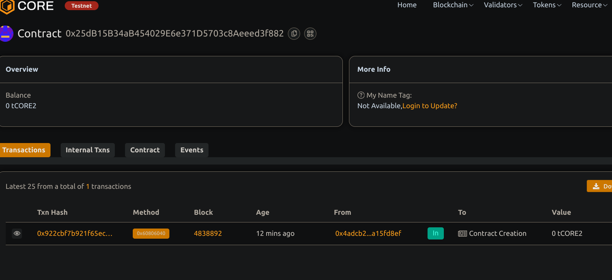

# Decentralized To-Do List Application

## 📝 Project Title
Decentralized To-Do List Application

## 📄 Project Description
This project is a decentralized task manager that allows users to add, update, delete, and toggle the completion status of their personal tasks. It stores all data on-chain, ensuring privacy and full control for the user.

## 🎯 Project Vision
To empower users to take full ownership of their productivity tools by eliminating central authority dependencies and building a censorship-resistant to-do list application using blockchain technology.

## 🚀 Key Features
- ✅ Add personal to-do tasks
- 🔄 Toggle task completion
- ❌ Delete completed or unwanted tasks
- 🔐 User-specific task storage using `msg.sender`
- 📡 Events for real-time front-end integration

🔮 Future Scope
🧠 Task Management Enhancements
Add support for deadlines and priority tagging to improve task organization.

📱 Front-End Integration
Develop a user-friendly interface using React/Next.js to interact seamlessly with the smart contract.

🔔 Automated On-Chain Reminders
Integrate Chainlink Keepers or Gelato to trigger reminders and automate task follow-ups.

🧾 Cross-Device Synchronization
Implement wallet-based login for secure and consistent access across devices.

📊 Task Analytics
Provide insights into completed vs. pending tasks through visual analytics and performance metrics.

## Contract details
0x25dB15B34aB454029E6e371D5703c8Aeeed3f882

